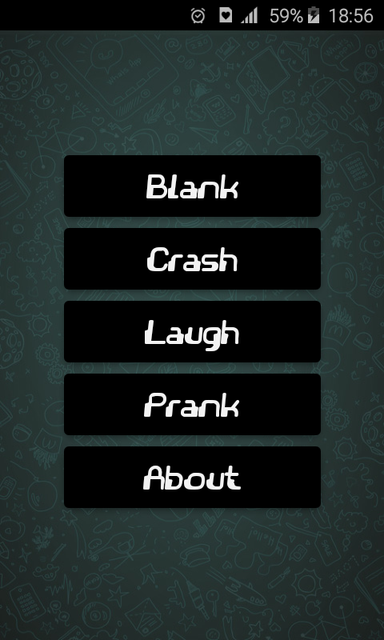

# WhatCrash
It help you frustrate message recipients. WhatCrash will crash the Whatsapp app when messages are opened and the only way to solve a problem is to delete all chats, including any media, that have been shared with the person who sent the message.

## Screenshot

## Getting Started

1. Download DroidScript Premium and ApkBuilder Plugin and install it
2. Clone this repository
3. Place this project to /sdcard/DroidScript 
4. Open DroidScript and long pressing on this project app icon and selecting the `Build APK` option.

## Contributing

There are multiple ways you can contribute to this project. We welcome contributions in all areas, with special attention to:
- Bug fixes
- Performance improvements
- Documentation improvements

## Contact Me
Line     : dtl.lily 
Telegram : @dtlily 
Facebook : cgi.izo
